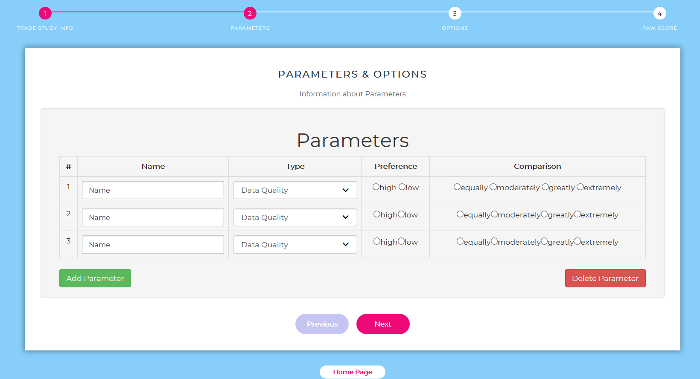

# Trade Study Execution and Analysis

Designed a website to conduct and store trade studies using [Vue.js](https://vuejs.org/), HTML, CSS, and JavaScript. Created algorithms with Analytical Hierarchy Process and analyzed subsequently data to identify trends using Java and MatLab

## Analytical Hierarchy Process

The [Analytic Hierarchy Process](https://en.wikipedia.org/wiki/Analytic_hierarchy_process) (AHP) was first created by Thomas Saaty in 1977. The model was designed to use pairwise comparisons, between both the options and the criteria used in the model, to create a model that could determine the optimal solution to a decision. The [Ideal Analytic Hierarchy Process](./docs/TSEAT%20intro.pdf), a revised version of the [Analytic Hierarchy Process](./docs/AHP%20algorithm.pdf), is what will be used in this model. While there are many different multi-criteria decision-making models that can be used, the Ideal Hierarchy Process is the least likely to give you an incorrect optimal solution.

[Ideal Analytic Hierarchy Process](./docs/AHP%20tutorial.pdf) will be used as basic algorithm in this model, and there are details of [algorithm and pseudo](./docs/TSEAT%20Algorithm.pdf). There is a paper to introduce [using analytic hierarchy process for decision making](./docs/AHP%20paper.pdf) as well.

## Tools

- [Vue](https://github.com/vuejs/vue): the progressive, incrementally-adoptable JavaScript framework for building UI on the web.
- Netbeans IDE: implement the algorithm with Java.
- MatLab: analysis the data and identify trends to generate a stacked bar scores.
- MySQL & SQL: storing, manipulating and retrieving data in databases.

## Evaluation

- Define Trade: trade study name, program name, topic name, author
- Define Parameters: numbers, names, types, preferences, comparisons
- Define Options: numbers, names
- Evaluate Options: receive raw score matrix
- Compare and Select: determine solution and confidence factor, plot results, export a data file with results in database

## Interface

**Home Page**

**Trade Study Information**

**Information about parameters**

**Information about options**

**Fill out Raw Score matrix**

